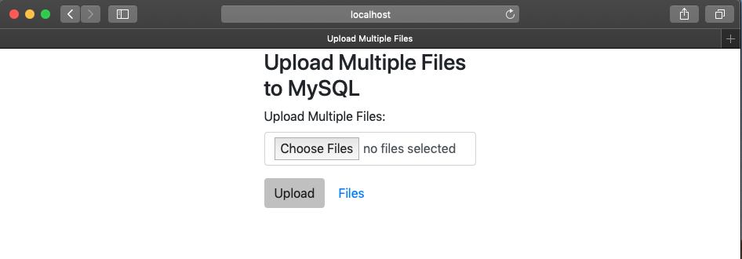
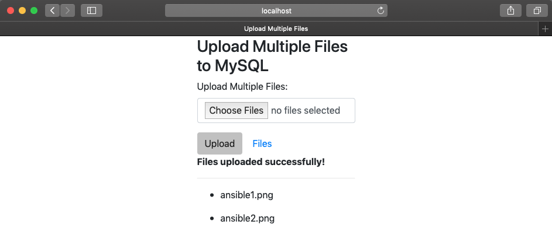
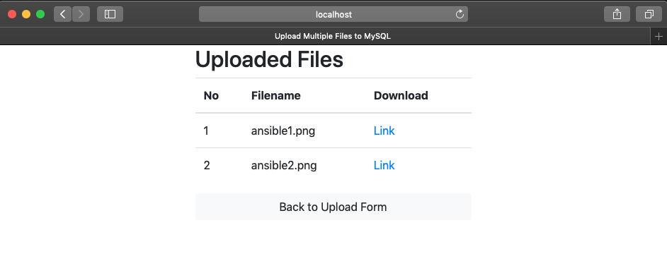
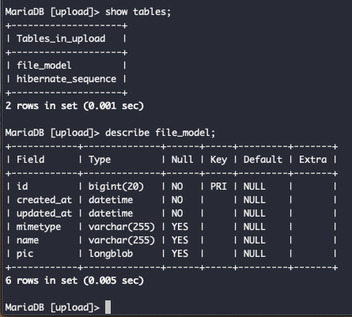
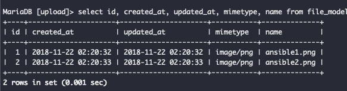

# springboot-upload-multiple-file-to-mysql

Run this project by this command : `mvn clean spring-boot:run`

Then open your favorite browser then type : http://localhost:8080

### Screenshot

Home Page

Upload Page

List Uploaded Page

Table Structure

Table Data

